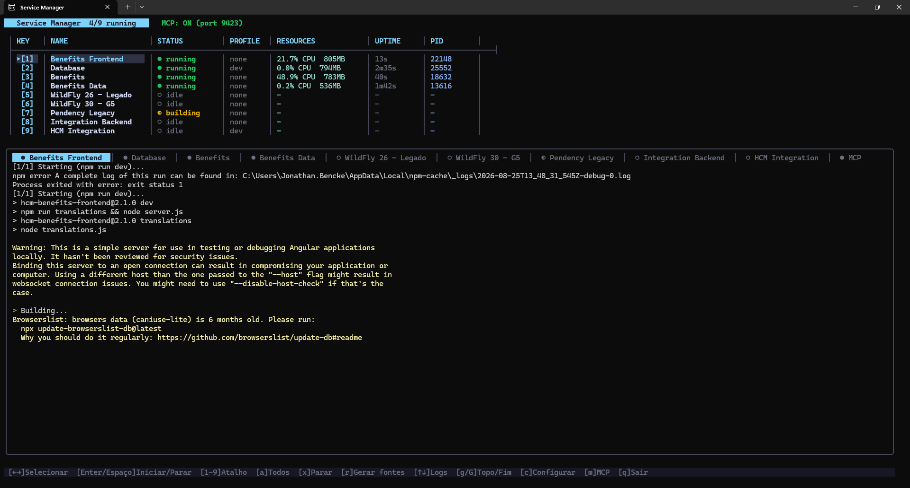

<div align="center">


# SMTUI

[](https://go.dev)
[](#-requisitos)
[](https://github.com/JonathanBencke/SMTUI/releases/latest)
[](./LICENSE)

</div>

Se você já perdeu a conta de quantos terminais abertos precisa pra rodar o
ambiente local inteiro — um pro backend, outro pro frontend, mais um pro
banco, outro pra ficar caçando log de erro — esse projeto é pra você.

O SMTUI é um painel de terminal (TUI) que junta todos esses
processos numa tela só. Você liga e desliga cada serviço com uma tecla, vê os
logs de todo mundo ao vivo, acompanha CPU/memória em tempo real e ainda expõe
tudo isso por [MCP](https://modelcontextprotocol.io/) — ou seja, dá pra pedir
pro seu assistente de IA ("sobe o Benefits", "me mostra o log da Database")
fazer isso por você.

Feito com [Bubble Tea](https://github.com/charmbracelet/bubbletea). Hoje roda
só em **Windows** (veja [Limitações](#-limitações)).



## 🚀 Comece agora

A forma mais rápida de usar o app — sem instalar Go, sem clonar repositório:

1. Baixe o `.zip` mais recente em **[Releases](https://github.com/JonathanBencke/SMTUI/releases/latest)**.
2. Descompacte em qualquer pasta.
3. Execute o `smtui.exe`.
4. **Configure seus serviços** — na primeira execução o app abre uma tela de
   boas-vindas te guiando; a qualquer momento, aperte `c` pra abrir a página
   web de configuração e ajustar tudo direto pelo navegador.

Pronto, seu painel tá no ar. 🎉

> Quer compilar do código-fonte ou contribuir com o projeto? Veja
> [Buildando do código-fonte](#-buildando-do-código-fonte).

---

## Sumário

- [🚀 Comece agora](#-comece-agora)
- [✨ O que ele faz por você](#-o-que-ele-faz-por-você)
- [📋 Requisitos](#-requisitos)
- [🛠️ Buildando do código-fonte](#-buildando-do-código-fonte)
- [🧠 Como funciona por baixo dos panos](#-como-funciona-por-baixo-dos-panos)
- [⚙️ Referência de configuração](#-referência-de-configuração)
  - [Presets](#presets)
  - [Defaults](#defaults)
  - [Serviços](#serviços)
  - [Variáveis de template](#variáveis-de-template)
  - [Precedência de variáveis de ambiente](#precedência-de-variáveis-de-ambiente)
- [➕ Cadastrando um novo serviço](#-cadastrando-um-novo-serviço)
  - [Opção A — editar o `services.toml`](#opção-a--editar-o-servicestoml)
  - [Opção B — página web de configuração (tecla `c`)](#opção-b--página-web-de-configuração-tecla-c)
  - [Receitas prontas (copiar e colar)](#receitas-prontas-copiar-e-colar)
    - [1. Java + Maven + Spring Boot](#1-java--maven--spring-boot)
    - [2. Node.js (npm)](#2-nodejs-npm)
    - [3. Python](#3-python)
    - [4. Go](#4-go)
    - [5. Docker Compose](#5-docker-compose)
    - [6. Serviço com build + run e variáveis de ambiente](#6-serviço-com-build--run-e-variáveis-de-ambiente)
  - [Criando seu próprio preset](#criando-seu-próprio-preset)
- [⌨️ Atalhos do teclado](#-atalhos-do-teclado)
- [🤖 Integração com MCP](#-integração-com-mcp)
  - [Tools disponíveis](#tools-disponíveis)
  - [Fluxo típico de um agente](#fluxo-típico-de-um-agente)
  - [Resources](#resources)
  - [Iniciando um serviço a partir de um git worktree (`start_service_at`)](#iniciando-um-serviço-a-partir-de-um-git-worktree-start_service_at)
- [⚠️ Limitações](#-limitações)
- [🤝 Contribuindo](#-contribuindo)
- [📄 Licença](#-licença)

## ✨ O que ele faz por você

- **Um painel só pra tudo** — inicia/para cada serviço individualmente, ou
  todos de uma vez.
- **Cada stack com sua receita** — você descreve como buildar e rodar cada
  serviço em templates TOML reutilizáveis (chamados de *presets*). Já vem com
  um preset pra Java/Maven pronto, mas funciona com qualquer stack: Node,
  Python, Go, Docker, o que você conseguir chamar do shell.
- **Log ao vivo, por serviço** — painel com scroll, atalho pra ir direto pro
  topo/fim e quebra de linha automática.
- **CPU e memória em tempo real**, serviço por serviço.
- **Profiles no estilo Spring** — liga/desliga profiles aplicados ao comando
  de run (tipo `--spring.profiles.active=dev`).
- **Página web de configuração** — aperta `c` e configura serviços, tenant/env
  e presets pelo navegador; salvar já grava direto no arquivo de config.
- **Servidor MCP embutido** — expõe 13 tools (`list_services`,
  `start_service`, `start_service_at`, `restart_service`, `stop_service`,
  `get_logs`, `search_logs`, `get_stats`, `wait_until_ready`,
  `get_service_config`, `generate_sources`, `start_all`, `stop_all`) e
  resources assináveis via SSE ou stdio, pra assistentes como o Claude Code
  operarem seus serviços diretamente (inclusive iniciando a partir de um git
  worktree). Toda resposta vem em JSON estruturado.
- **Ícone e título customizados** no console do Windows.

## 📋 Requisitos

Só se aplica a quem vai **buildar do código-fonte** — quem baixou o `.zip` da
release não precisa de nada disso além do próprio Windows.

- **Windows** (usa `taskkill`, PowerShell pra estatísticas e APIs Win32 do
  console).
- **Go 1.23+** pra compilar.
- [`rsrc`](https://github.com/akavel/rsrc), só se você quiser regerar o ícone
  embutido do executável:
  ```powershell
  go install github.com/akavel/rsrc@latest
  ```

## 🛠️ Buildando do código-fonte

```powershell
git clone https://github.com/JonathanBencke/SMTUI.git
cd SMTUI
make build                 # gera o smtui.exe (e também regenera o ícone)
# ou, sem make:
go build -o smtui.exe .
```

Crie um `services.toml` do lado do executável (veja
[Cadastrando um novo serviço](#-cadastrando-um-novo-serviço)) e rode:

```powershell
./smtui.exe
```

Na **primeira execução**, se não encontrar nenhum `services.toml`, o app cria
sozinho um arquivo inicial comentado (já com os presets `java-maven`,
`spring-boot`, `wildfly`, `hcm-integration` e `node-npm` prontos pra usar) e
abre uma **tela de boas-vindas** te guiando até a página web de configuração
(`c`) pra criar o primeiro serviço — sem precisar editar nada na mão.

Também dá pra apontar pra um arquivo específico:

```powershell
./smtui.exe path/to/my-services.toml
```

### Compartilhando com o time

Pra distribuir a ferramenta, gere um `.zip` com o `smtui.exe`, um
`services.example.toml` comentado (gerado a partir do mesmo arquivo inicial
usado na primeira execução, então nunca fica desatualizado) e o README/LICENSE:

```powershell
make package
# ou, sem make:
go build -o smtui.exe .
go run ./tools/packager
```

O pacote fica em `dist/ServiceManagerTUI.zip`. É esse mesmo arquivo que sobe
como asset numa [release](https://github.com/JonathanBencke/SMTUI/releases)
do GitHub, pra qualquer um do time baixar direto sem precisar compilar (veja
[Comece agora](#-comece-agora)).

## 🧠 Como funciona por baixo dos panos

Todo serviço é descrito por **dois comandos** (`build` e `run`) mais um
**ambiente**. Pra não repetir os mesmos comandos em cada serviço, eles ficam
guardados num **preset**, e cada serviço só referencia o preset pelo nome e
preenche as variáveis dele (classe principal, módulos, workdir, etc.).

```
+-----------------+     runner="java-maven"     +------------------+
|   [[service]]   |  ----------------------->   | [presets.X]      |
|  name, workdir, |                              | build = "..."    |
|  main_class,    |     + variáveis ({{.X}})     | run   = "..."    |
|  modules, ...   |  ----------------------->   | [presets.X.env]  |
+-----------------+                              +------------------+
        |                                                |
        |  [defaults.env]  +  [service.env]  <----------+
        v
   ambiente final do processo
```

Os comandos são [templates Go](https://pkg.go.dev/text/template) preenchidos
com os campos do serviço, depois quebrados no estilo shell (aspas simples e
duplas são respeitadas) e executados dentro do `workdir` do serviço.

## ⚙️ Referência de configuração

Ao subir, o app procura `services.toml` do lado do executável e, se não
achar, tenta `./services.toml` no diretório atual. O arquivo tem três seções.

### Presets

Uma definição reutilizável de como buildar e rodar um serviço. `build` e `run`
são templates Go; `env` é um mapa de variáveis de ambiente (os valores também
aceitam templates). `build` é opcional — um serviço pode ser só de execução.

```toml
[presets.java-maven]
build = "mvn -pl {{.Modules}} -am install -DskipTests"
run   = "mvn -pl impl compile org.codehaus.mojo:exec-maven-plugin:3.2.0:java -Dexec.mainClass={{.MainClass}} -Dexec.classpathScope=runtime{{if .Profiles}} -Dexec.args=--spring.profiles.active={{.Profiles}}{{end}}"

[presets.java-maven.env]
JAVA_HOME = "{{.JavaHome}}"
PATH      = "{{.JavaHome}}\\bin;{{.Path}}"
```

#### Geração de fontes sob demanda pra projetos SDL/PDL/EDL

Projetos Senior SDL/PDL/EDL precisam rodar `mvn generate-sources` pra manter
os fontes gerados (`client`/`server`) sincronizados com as definições
`.sdl`/`.pdl`/`.edl`. O app roda esse passo **sob demanda** — nunca como parte
de um start —, então iniciar um serviço é sempre só build + run, sem surpresa.

Dispare com a tecla `r` na TUI (veja os [atalhos](#-atalhos-do-teclado)) ou
pela tool MCP `generate_sources`. Se o serviço estiver rodando, ele é parado
antes e **não** é reiniciado depois.

- A raiz do projeto é descoberta a partir do `workdir` do serviço: um arquivo
  `.sdl` (normalmente `main.sdl`, mas às vezes com o nome do domínio, tipo
  `career.sdl`) nesse diretório ou em até 5 diretórios pai (geralmente a raiz
  do projeto, acima de `java/impl`).
- Por padrão o comando é `mvn clean generate-sources` e roda na raiz do
  projeto encontrada (não no `workdir` do serviço).
- Dá pra sobrescrever por preset com `sdl_generate_command`:

  ```toml
  [presets.java-maven]
  build = "mvn -pl {{.Modules}} -am install -DskipTests"
  run   = "mvn -pl impl compile org.codehaus.mojo:exec-maven-plugin:3.2.0:java -Dexec.mainClass={{.MainClass}} -Dexec.classpathScope=runtime"
  sdl_generate_command = "mvn clean generate-sources"
  ```

- Se nenhum arquivo `.sdl` for encontrado, o pedido é ignorado e uma linha fica
  registrada no log (`No main.sdl found, skipping generate-sources`), sem
  mexer no status do serviço — ou seja, apertar `r` é inofensivo em serviços
  que não são SDL (tipo `node-npm`, `wildfly`).
- Enquanto o comando roda, o serviço mostra o status `generating`; se der
  erro, vira `crashed` e o erro fica no log.
- Esse campo também pode ser editado pela
  [página web de configuração](#opção-b--página-web-de-configuração-tecla-c),
  dentro de cada preset.

### Defaults

Configurações globais aplicadas a todo serviço. `env` é injetado em todo
processo (normalmente usado pra infra compartilhada, tipo um broker de
mensagens ou o tenant).

```toml
[defaults]
[defaults.env]
BROKER_HOST     = "broker.example.com"
BROKER_PORT     = "5674"
TENANT          = "acme"
VIRTUAL_HOST    = "acme"
DIAGNOSTIC_PORT = "0"
```

### Serviços

Cada `[[service]]` referencia um preset via `runner` e preenche as variáveis
do template. Um serviço pode sobrescrever o preset direto com `build_command`
/ `run_command`, e adicionar `env` específico dele.

```toml
[[service]]
name         = "Database"          # obrigatório
runner       = "java-maven"        # referencia um [presets.<name>]
workdir      = "../my-backend/java"# obrigatório; relativo ao arquivo de config
java_home    = "C:\\Program Files\\Java\\JDK17"
modules      = ["client", "server"]
main_class   = "org.example.Main"
profiles     = ["dev"]
health_port  = 0                   # reservado pra health check (0 = desligado)

# Overrides opcionais (têm prioridade sobre o preset):
# build_command = "..."
# run_command   = "..."

# Env específico do serviço (some por cima, veja a precedência abaixo):
# [service.env]
# FOO = "bar"
```

### Variáveis de template

| Variável         | O que é                                                |
|------------------|----------------------------------------------------------|
| `{{.Name}}`      | O `name` do serviço                                      |
| `{{.Workdir}}`   | O diretório de trabalho resolvido                        |
| `{{.JavaHome}}`  | O `java_home` do serviço                                 |
| `{{.Modules}}`   | `modules` juntos com `,`                                 |
| `{{.MainClass}}` | O `main_class` do serviço                                |
| `{{.Profiles}}`  | `profiles` juntos com `,` (string vazia se não tiver nenhum) |
| `{{.Path}}`      | O `PATH` do processo pai                                 |

Você pode usar toda a sintaxe de template do Go, incluindo condicionais:
`{{if .Profiles}} ... {{end}}`.

#### Variáveis customizadas de preset

Um preset pode referenciar qualquer variável além das built-in acima (tipo
`{{.IntegrationPropertiesDir}}`). Elas vêm de uma tabela `[service.vars]` por
serviço:

```toml
[presets.hcm-integration]
build = 'cmd /c "copy /Y {{.IntegrationPropertiesDir}}\integration.properties integration.properties && mvn compile"'

[[service]]
name   = "hcm-integration"
runner = "hcm-integration"
workdir = "../hcm-integracao/src/hcm-integration"
[service.vars]
IntegrationPropertiesDir = "..\\..\\.."
```

A página web de configuração detecta essas variáveis sozinha e pergunta por
elas (o preset `hcm-integration`, por exemplo, pede o diretório onde fica o
`integration.properties`) — então não precisa editar nada na mão.

As strings de comando são quebradas no estilo shell (aspas simples e duplas
são respeitadas), então coloque entre aspas qualquer argumento que tenha
espaço.

### Precedência de variáveis de ambiente

Pra cada processo, o app monta o ambiente em camadas — a camada mais tardia
sobrescreve a anterior quando o nome é o mesmo (sem diferenciar
maiúsculas/minúsculas):

```
1. Ambiente do sistema operacional (do processo do smtui)
2. defaults.env
3. presets.<runner>.env
4. service.env
```

Ou seja: um `[service.env]` sempre ganha de `[defaults.env]`, que ganha do seu
ambiente de shell.

## ➕ Cadastrando um novo serviço

Tem dois jeitos: editar o `services.toml` direto (mais poder) ou usar a
página web de configuração do próprio app (mais rápido, pra casos simples).

### Opção A — editar o `services.toml`

1. Abra o `services.toml` do lado do executável.
2. Confira se já existe um preset compatível com sua stack na seção
   `[presets.*]` (o preset `java-maven` já vem por padrão — veja as
   [receitas prontas](#receitas-prontas-copiar-e-colar) pras outras stacks).
3. Acrescente um novo bloco `[[service]]`:

```toml
[[service]]
name       = "my-service"
runner     = "java-maven"
workdir    = "../my-service/java"
java_home  = "C:\\Program Files\\Java\\JDK17"
modules    = ["client", "server"]
main_class = "com.acme.MyApplication"
profiles   = ["dev"]
health_port = 0
```

4. Salve o arquivo. Com a TUI aberta, aperte `c` pra abrir a config web e
   clique em Salvar (ou reinicie o `smtui.exe`) — a tabela recarrega a config
   e seu serviço aparece.

> Dica: caminhos relativos em `workdir` são resolvidos a partir do local do
> **arquivo de config**, não do diretório atual. Na dúvida, use caminhos
> absolutos.

### Opção B — página web de configuração (tecla `c`)

O jeito mais amigável de configurar tudo, pensado pra ninguém do time
precisar aprender o formato TOML. Com a TUI rodando (ou na tela de
boas-vindas), aperte `c`: o app sobe um servidor web local em
`http://127.0.0.1:9424/` e abre no seu navegador padrão.

Na página dá pra editar, tudo num lugar só:

- **Ambiente / Tenant** — as variáveis compartilhadas de `[defaults.env]`
  (tenant, broker, etc.).
- **Serviços** — adicionar, editar e remover serviços: nome, preset (runner),
  workdir, Java Home, módulos, classe principal / caminho do `.bat`, profiles,
  health port, overrides de `build_command`/`run_command`, além de
  `[service.env]` e `[service.vars]` por serviço (tipo `IntegrationProperties`).
- **Presets** — os templates `build`/`run` e o `env` de cada preset.

A página foi pensada pra reduzir ruído visual e evitar perda de trabalho:

- **Campos dinâmicos por preset** — só aparecem os campos que o preset
  selecionado realmente usa (ex.: Java Home/Módulos só se o preset referenciar
  `{{.JavaHome}}`/`{{.Modules}}`); o resto fica escondido em vez de só listado
  como "opcional".
- **Seção "Avançado" recolhível** — overrides de `build_command`/`run_command`
  e as variáveis (`[service.vars]`/`[service.env]`) ficam colapsados por
  padrão em cada serviço, abrindo sozinhos só quando já têm algo preenchido.
  Serviço recém-criado sempre abre expandido, guiando o preenchimento.
  Também dá pra fechar e abrir os cards de serviço; com mais de 5 serviços
  cadastrados, só o que você acabou de adicionar fica aberto por padrão.
- **Busca por nome** — filtra a lista de serviços na hora, útil quando há
  muitos cadastrados.
- **Confirmação antes de excluir** — remover um serviço ou preset pede
  confirmação (excluir um preset em uso avisa que os serviços dependentes
  ficam sem preset).
- **Aviso de alterações não salvas** — um indicador aparece no cabeçalho
  assim que você edita algo; "Recarregar" e fechar a aba avisam antes de
  descartar o que não foi salvo.

Clica em **Salvar** e a configuração inteira é regravada em `services.toml`;
a TUI recarrega sozinha e os serviços aparecem na tabela.

> A página web só aceita conexões locais e rejeita cabeçalhos `Host` que não
> sejam loopback. Ela não tem autenticação — qualquer processo que consiga
> acessar `127.0.0.1:9424` na sua máquina pode editar a config, o mesmo nível
> de confiança de editar o arquivo direto.

> Nota: salvar pela página web reescreve o `services.toml` a partir do estado
> do editor, então comentários escritos à mão no arquivo não são preservados.

### Receitas prontas (copiar e colar)

Cada receita é independente: adicione o preset (uma vez só) na seção
`[presets.*]` e os blocos `[[service]]` que precisar.

#### 1. Java + Maven + Spring Boot

Preset (já vem por padrão):

```toml
[presets.java-maven]
build = "mvn -pl {{.Modules}} -am install -DskipTests"
run   = "mvn -pl impl compile org.codehaus.mojo:exec-maven-plugin:3.2.0:java -Dexec.mainClass={{.MainClass}} -Dexec.classpathScope=runtime{{if .Profiles}} -Dexec.args=--spring.profiles.active={{.Profiles}}{{end}}"

[presets.java-maven.env]
JAVA_HOME = "{{.JavaHome}}"
PATH      = "{{.JavaHome}}\\bin;{{.Path}}"
```

Serviço:

```toml
[[service]]
name       = "users-api"
runner     = "java-maven"
workdir    = "../users-api/java"
java_home  = "C:\\Program Files\\Java\\JDK17"
modules    = ["client", "server"]
main_class = "com.acme.users.UsersApplication"
profiles   = ["dev"]
health_port = 0
```

O mesmo JDK pode ser compartilhado entre serviços; basta repetir `java_home`
em cada um (ou mover `JAVA_HOME` pra `[defaults.env]` e tirar do preset).

#### 2. Node.js (npm)

```toml
[presets.node-npm]
build = "npm install"
run   = "npm start"

[[service]]
name    = "web-frontend"
runner  = "node-npm"
workdir = "../web-frontend"
main_class = "unused-by-npm"   # o template exige um valor; este preset não usa

# Serviços Node costumam precisar de saída sem buffer:
[service.env]
PYTHONUNBUFFERED = "1"
```

> Como `npm start` não usa `{{.MainClass}}`, o campo é opcional na página web
> e ignorado por esse preset. Editando `services.toml` direto, dá pra omitir.

Node puro (sem build, roda um arquivo só):

```toml
[presets.node]
run = "node {{.MainClass}}"

[[service]]
name       = "worker"
runner     = "node"
workdir    = "../worker"
main_class = "worker.js"
```

#### 3. Python

```toml
[presets.python]
run = "python {{.MainClass}}"

[[service]]
name       = "ml-api"
runner     = "python"
workdir    = "../ml-api"
main_class = "app.py"

[service.env]
PYTHONUNBUFFERED = "1"
```

Usando um virtualenv:

```toml
[presets.python-venv]
run = ".\\.venv\\Scripts\\python.exe {{.MainClass}}"

[[service]]
name       = "ml-api"
runner     = "python-venv"
workdir    = "../ml-api"
main_class = "app.py"
```

#### 4. Go

```toml
[presets.go]
build = "go build -o app.exe ."
run   = ".\\app.exe"

[[service]]
name    = "gateway"
runner  = "go"
workdir = "../gateway"
```

#### 5. Docker Compose

```toml
[presets.compose]
run = "docker compose up"

[[service]]
name    = "postgres"
runner  = "compose"
workdir = "../infra"
```

Com um passo de build (builda as imagens antes):

```toml
[presets.compose-build]
build = "docker compose build"
run   = "docker compose up"
```

#### 6. Serviço com build + run e variáveis de ambiente

Mostra overrides por serviço e env compartilhado:

```toml
[defaults]
[defaults.env]
# Compartilhado por todo serviço
REDIS_URL = "redis://127.0.0.1:6379"

[presets.node-npm]
build = "npm install"
run   = "npm start"

[[service]]
name         = "api"
runner       = "node-npm"
workdir      = "../api"
main_class   = "n/a"

# Sobrescreve o comando de run do preset só pra esse serviço:
run_command  = "node src/server.js"

[service.env]
PORT = "3000"
NODE_ENV = "development"
```

### Criando seu próprio preset

1. Escolha um nome curto, tipo `rust`.
2. Defina `build` e/ou `run` como templates Go. Presets só de execução podem
   omitir `build`.
3. Adicione o ambiente que o processo precisa em `[presets.<name>.env]`.
4. Referencie a partir de um serviço com `runner = "rust"`.

```toml
[presets.rust]
build = "cargo build"
run   = "cargo run"

[[service]]
name    = "cli-tool"
runner  = "rust"
workdir = "../cli-tool"
```

Helpers de template disponíveis: condicionais (`{{if .X}}...{{end}}`) e as
variáveis da tabela de [Variáveis de template](#variáveis-de-template). Se
precisar de uma variável que não é exposta, sempre dá pra colocar o valor
direto no `run_command` do serviço.

## ⌨️ Atalhos do teclado

Rode `./smtui.exe`. Teclas:

| Tecla           | Ação                                     |
|-----------------|-------------------------------------------|
| `←` / `→`       | Seleciona a aba de serviço/log (serviços + MCP) |
| `Enter`/`Espaço`| Inicia/para o serviço selecionado         |
| `1`-`9`         | Atalho pra ligar/desligar o serviço N     |
| `a`             | Inicia todos os serviços                  |
| `x`             | Para todos os serviços (força)            |
| `↑` / `↓`       | Rola os logs pra cima / pra baixo         |
| `PgUp` / `PgDn` | Rola os logs de 10 em 10                  |
| `g` / `G`       | Vai pro topo / fim dos logs               |
| `r`             | Roda `generate-sources` só do serviço selecionado (sem build/run) |
| `c`             | Abre a página web de configuração (serviços, tenant/env, presets) |
| `m`             | Liga/desliga o servidor MCP               |
| `q` / `Ctrl+C`  | Sai                                       |

Ícones de status: `●` rodando · `◐` buildando · `◒` gerando fontes · `◑`
parando · `✖` crashado · `○` parado/idle.

> Apertar `r` roda **só** o passo de geração de fontes do serviço
> selecionado: se ele estiver rodando, é parado primeiro (e **não** é
> reiniciado depois), o status vira `generating` enquanto o `mvn` trabalha, e
> a saída é transmitida pro painel de log do serviço. Se o workdir não estiver
> dentro de um projeto SDL, o passo é ignorado e o status fica como estava.

> As variáveis de tenant/broker (`TENANT`, `VIRTUAL_HOST`, `BROKER_HOST`,
> `BROKER_PORT`, `DIAGNOSTIC_PORT`) ficam em `[defaults.env]` e são
> compartilhadas por todo serviço. Aperte `c` pra abrir a página web e editar
> elas por lá — os valores são gravados de volta em `[defaults.env]` no
> `services.toml`.

## 🤖 Integração com MCP

O app vem com um servidor MCP embutido. Toda tool responde com **texto legível
e um JSON estruturado** (`structuredContent`) — o agente lê o JSON, o humano lê
o texto. Nenhum cliente antigo quebra: o texto continua no mesmo formato.

### Tools disponíveis

| Tool | O que faz | Tipo |
|---|---|---|
| `list_services` | Status, PID, uptime, profiles e workdir de todos os serviços | 🔍 leitura |
| `get_logs` | Logs de um serviço; aceita `since_index` pra ler só o que é novo | 🔍 leitura |
| `search_logs` | Busca regex (RE2) nos logs, com filtro de nível e linhas de contexto | 🔍 leitura |
| `get_stats` | CPU e memória da árvore de processos, de um serviço ou de todos | 🔍 leitura |
| `wait_until_ready` | Bloqueia até o serviço subir (status + `health_port` respondendo) | 🔍 leitura |
| `get_service_config` | Config efetiva: preset, comandos expandidos, profiles, env (redigido) | 🔍 leitura |
| `start_service` | Inicia um serviço a partir do workdir configurado | ▶️ escrita |
| `start_service_at` | Inicia a partir de um diretório customizado (git worktree) | ▶️ escrita |
| `generate_sources` | Roda só o `generate-sources` (SDL/PDL/EDL), sem buildar nem subir | ▶️ escrita |
| `start_all` | Inicia todos os serviços | ▶️ escrita |
| `restart_service` | Para e sobe de novo, **preservando** o workdir customizado | ⚠️ destrutiva |
| `stop_service` | Para um serviço (force kill da árvore de processos) | ⚠️ destrutiva |
| `stop_all` | Para todos os serviços | ⚠️ destrutiva |

Cada tool declara `readOnlyHint`/`destructiveHint`/`idempotentHint` e um
`outputSchema`, então o cliente sabe o que é seguro chamar sozinho e qual é o
formato da resposta antes da primeira chamada.

### Fluxo típico de um agente

```
list_services                              → descobre os nomes exatos
start_service("Benefits")                  → dispara o build/run
wait_until_ready("Benefits", 300)          → bloqueia até responder na porta
search_logs("Benefits", "Caused by", 3)    → se falhar, vai direto na causa
get_stats("Benefits")                      → checa consumo de CPU/memória
```

`wait_until_ready` substitui o polling manual: ela devolve assim que o status
vira `running` **e** a `health_port` aceitar conexão. Se o serviço morrer no
meio do caminho, ela falha na hora e já devolve as últimas linhas do log.

`generate_sources` roda só o passo de geração de fontes (mesmo comportamento da
tecla `r`: para o serviço se estiver rodando, e não reinicia depois). Ela
retorna na hora — acompanhe com `get_logs(..., since_index=...)` até o status
sair de `generating`.

> **Buffer de log limitado.** Cada serviço guarda as últimas 500 linhas. Um
> `search_logs` sem resultado significa "não está no buffer retido", não
> "nunca aconteceu".

### Resources

Além das tools, o servidor publica resources **assináveis** — o cliente recebe
`notifications/resources/updated` quando o estado muda, em vez de ficar
consultando `list_services` em loop (as notificações são agrupadas a cada 1s
pra não inundar o cliente durante um build verboso do Maven):

| URI | Conteúdo |
|---|---|
| `smtui://services` | Status de todos os serviços (JSON) |
| `smtui://services/{name}` | Estado de um serviço (JSON) |
| `smtui://services/{name}/logs` | Logs bufferizados (texto) |
| `smtui://services/{name}/config` | Config efetiva do serviço (JSON) |
| `smtui://config` | O `services.toml` cru (somente leitura) |
| `smtui://presets` | Presets disponíveis e suas variáveis de template |

> O MCP **nunca escreve** configuração. Pra alterar serviços, use a página web
> (tecla `c`) ou edite o `services.toml`. Valores de variáveis de ambiente vêm
> redigidos por padrão, e chaves com cara de segredo (`pass`, `token`, `key`,
> `secret`, `credential`, `auth`) ficam mascaradas mesmo com
> `include_env=true`.

### Iniciando um serviço a partir de um git worktree (`start_service_at`)

`start_service_at` recebe o `name` de um serviço mais um `workdir`, e inicia o
serviço a partir desse diretório em vez do `workdir` declarado no
`services.toml`. Ela existe pra agentes que fazem checkout do projeto num
**git worktree** (um diretório por branch) e precisam buildar e rodar essa
cópia sem mexer na configuração.

```json
{
  "name": "Benefits",
  "workdir": "C:\\worktrees\\hcmpg-8210\\java\\impl"
}
```

Como funciona:

- O diretório precisa existir; um caminho ausente ou um arquivo (em vez de
  pasta) é rejeitado e o serviço fica intocado. Caminhos relativos são
  resolvidos a partir do diretório do processo `smtui`, então prefira
  caminhos absolutos.
- O serviço precisa estar parado — iniciar a partir de outro diretório
  enquanto um build ou processo já está rodando é recusado.
- O override é **fixo pras tools MCP**: as próximas chamadas de
  `start_service`, `restart_service`, `stop_service` e `generate_sources`
  reaproveitam o diretório customizado, inclusive na busca da raiz do projeto
  `.sdl` (que sobe a partir do workdir sobrescrito) — assim o agente continua
  trabalhando no mesmo checkout.
- **Starts disparados pelo terminal sempre usam o workdir configurado.**
  Apertar `Enter`/`Espaço`, `1`-`9` ou `a` na TUI descarta o override (fica
  registrado no log) e roda o serviço a partir do `workdir` do
  `services.toml` — assim a pessoa no teclado nunca é surpreendida por um
  worktree deixado por um agente.
- O override também termina quando o `smtui` reinicia, ou quando o workdir
  configurado é passado de volta pro `start_service_at`.
- `list_services` lista cada override ativo junto com o workdir configurado,
  então passar esse caminho de volta pro `start_service_at` restaura o
  diretório original.

**Modo embutido** — com a TUI rodando, aperte `m` pra ligar o servidor SSE em
`127.0.0.1:9423`.

**Modo standalone via stdio** — roda sem a TUI, ideal pro Claude Code:

```powershell
./smtui.exe -mcp
```

Exemplo de config do Claude Code (`.claude.json` ou equivalente):

```json
{
  "mcpServers": {
    "service-manager": {
      "command": "C:\\path\\to\\smtui.exe",
      "args": ["-mcp"]
    }
  }
}
```

Depois é só pedir pro seu assistente coisas como "lista meus serviços",
"inicia o users-api", "mostra as últimas 20 linhas do log da Database".

<details>
<summary>🔧 Registro automático no <strong>kiro-cli</strong> (opcional)</summary>

Em vez de editar JSON na mão, deixe o `smtui` se registrar sozinho nas
configurações do [kiro-cli](https://kiro.dev). Ele registra um **servidor
remoto apontando pro servidor que a própria TUI já roda**
(`http://127.0.0.1:9423/mcp`, Streamable HTTP), então o kiro-cli conecta na
*mesma* instância em execução e no mesmo estado dos serviços — ele **não**
sobe um segundo servidor.

```powershell
# Global (~/.kiro/settings/mcp.json) — disponível em todo workspace
./smtui.exe -install-mcp

# Ou só pro projeto atual (.kiro/settings/mcp.json)
./smtui.exe -install-mcp -scope workspace
```

Isso adiciona uma entrada `service-manager` com `url:
http://127.0.0.1:9423/mcp`, **preservando qualquer outro servidor** já
configurado. Deixe a TUI aberta (o MCP vem ligado por padrão) pra o kiro-cli
conseguir conectar; reinicie o kiro-cli (ou rode `/mcp` no chat) pra ele
pegar a mudança. Pra remover:

```powershell
./smtui.exe -uninstall-mcp            # global
./smtui.exe -uninstall-mcp -scope workspace
```

Prefere um processo standalone em vez de conectar na TUI? Ainda dá pra
registrar o modo stdio manualmente:
`kiro-cli mcp add --name service-manager --command C:\path\to\smtui.exe --args -mcp`.

</details>

## ⚠️ Limitações

- **Só Windows.** O controle de processos usa `taskkill`, as estatísticas de
  recurso usam PowerShell/CIM, e o ícone do console usa APIs Win32. Suporte
  multiplataforma não está implementado.
- Os comandos de build/run são quebrados no lado do app (sem recursos de
  shell como pipe `|`, `&&` ou redirecionamento). Se precisar disso, aponte o
  `run_command` pra um script.

## 🤝 Contribuindo

1. Crie uma branch a partir de `main`.
2. Abra um Pull Request contra `main` no [SMTUI](https://github.com/JonathanBencke/SMTUI).
3. O merge exige pelo menos **uma aprovação** — a proteção da branch `main`
   bloqueia merge direto sem review.
4. Antes de abrir o PR, rode `go build ./... && go vet ./... && go test ./...`.

## 📄 Licença

[MIT](./LICENSE)
